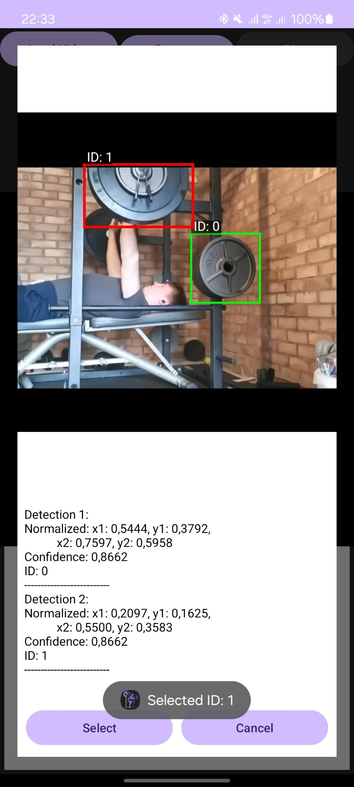
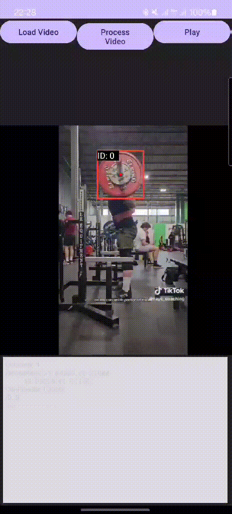

# Barbell Path Tracking App

This repository contains a **demo Android application** for an on-device object detection and tracking system designed to detect and track barbells in weightlifting videos.

The project serves as a **proof of concept** and a technical foundation for a future, full-featured barbell tracking and training analytics app built around this core pipeline.

---

## Overview

The app demonstrates how real-time computer vision can be executed **entirely on-device**, without any server-side processing. All object detection and tracking computations run locally on the phone and are optimized to work on **lower-spec Android devices**.

It uses a **YOLOv8n model** for object detection and integrates a **SORT tracking algorithm** to preserve object identity across frames. Inference is performed with **TensorFlow Lite** and accelerated using the **GPU delegate** for smooth performance.

The primary focus of this project is **functionality and feasibility**, not UI polish. The goal is to prove that accurate barbell tracking and motion visualization can be achieved efficiently on mobile hardware, before building a full user-facing product around it.

---

## Current Features

* On-device YOLOv8n barbell detection
* SORT-based multi-object tracking
* GPU delegate support for optimized inference
* Pre-recorded video processing
* Manual barbell selection prior to tracking
* Visualization of barbell motion using bounding boxes and trajectory paths

---

## Demo

### Barbell Selection

Manual barbell selection before processing allows the tracker to focus on the correct object.

    

### Detection & Tracking Overlay

Example of detection and tracking overlay rendered directly on the processed video.

    

---

## Development Status

This project is **actively under development**. The current version demonstrates the core computer vision pipeline, including detection, tracking, and visualization. Upcoming work will focus on improving robustness, configurability, and expanding analytical capabilities.

---

## Future Plans

* **Video ratio flexibility**: support multiple aspect ratios (currently optimized for 1:1 videos)
* **Model configuration**: switch between different YOLO models based on accuracy vs. performance needs
* **Additional analytics**: repetition counting, range of motion estimation, and velocity tracking
* **Pipeline hardening**: improve modularity and fault tolerance for real-world usage
* **Full app build**: design and implement a complete user-facing application around this core

---

## Requirements

* **Android Studio** (latest version)
* **Kotlin**
* **OpenCV for Android**
* **TensorFlow Lite** with GPU delegate support
* **YOLOv8n TFLite model**

---

## Acknowledgements

Special thanks to:

* The author of the Java implementation of the SORT tracking algorithm used in this project:
  [https://github.com/GivralNguyen/sort-java](https://github.com/GivralNguyen/sort-java)

* The creator of the fast video frame extraction implementation used directly within the app:
  [https://github.com/duckyngo/Fast-Video-Frame-Extraction](https://github.com/duckyngo/Fast-Video-Frame-Extraction)

---

## Notes

This repository represents a **functional proof of concept** rather than a polished product. UI and UX were intentionally deprioritized in favor of validating that efficient, on-device barbell tracking is achievable. The long-term goal is to evolve this into a complete training and analytics application built on top of this validated core.
